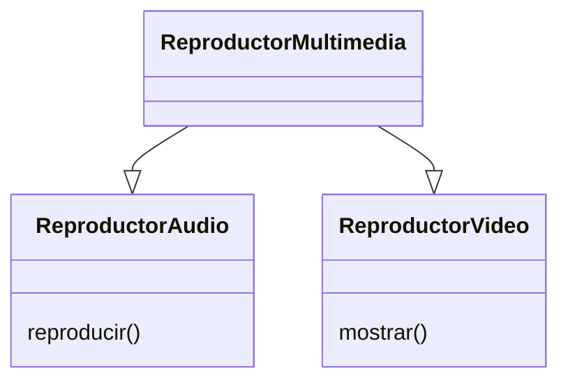

# Ejercicio 4: Herencia múltiple - De diagrama a código

**Enunciado:**
A partir del siguiente diagrama de clases, genera el código correspondiente:



**Objetivo:**
- Traducción de diagramas.
- Sintaxis de herencia múltiple.

```cpp
#include <iostream>
using namespace std;

// Completa las clases según el diagrama
```
